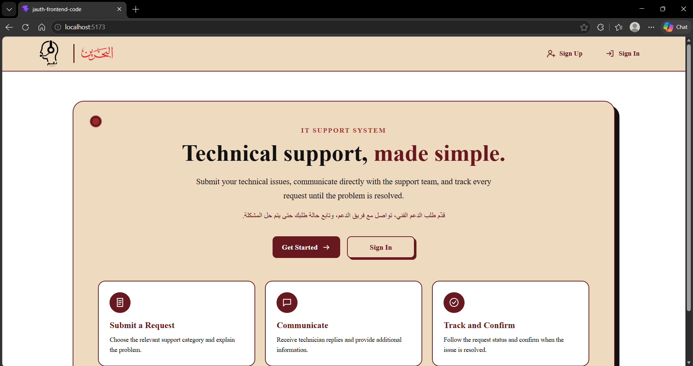
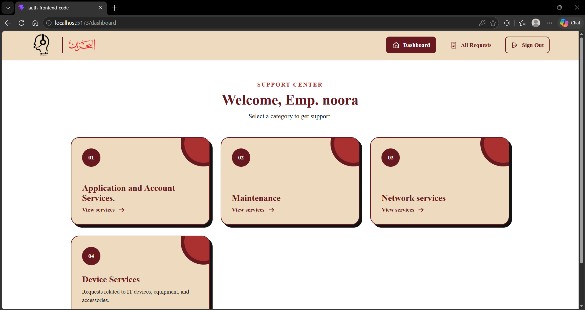
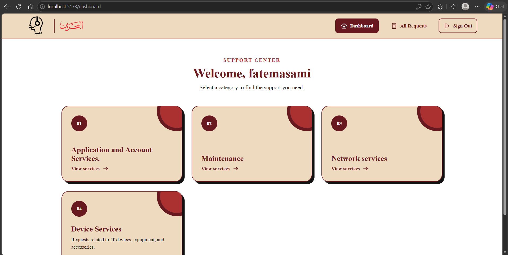
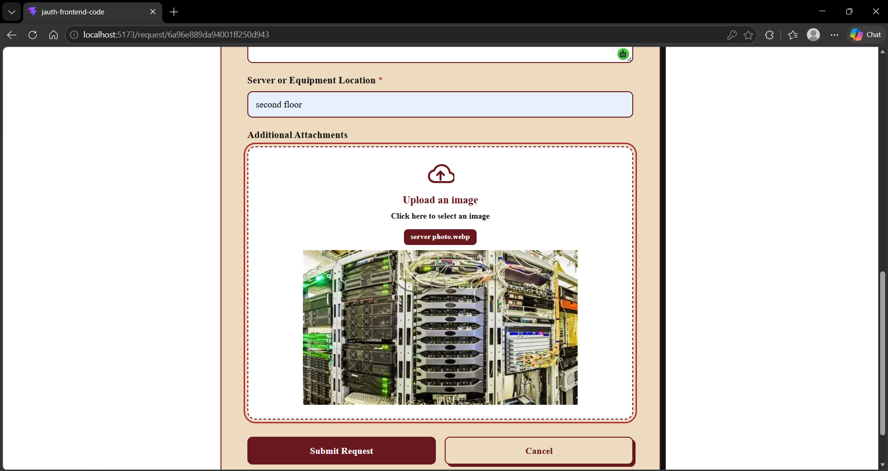
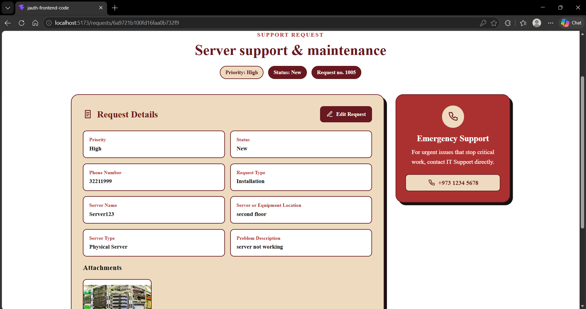
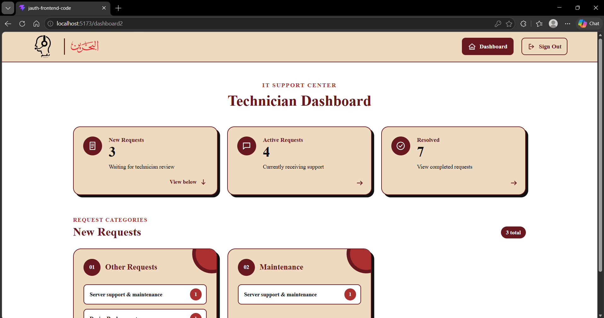
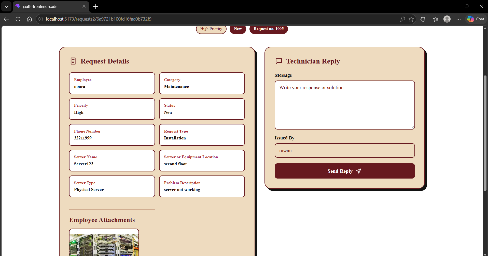
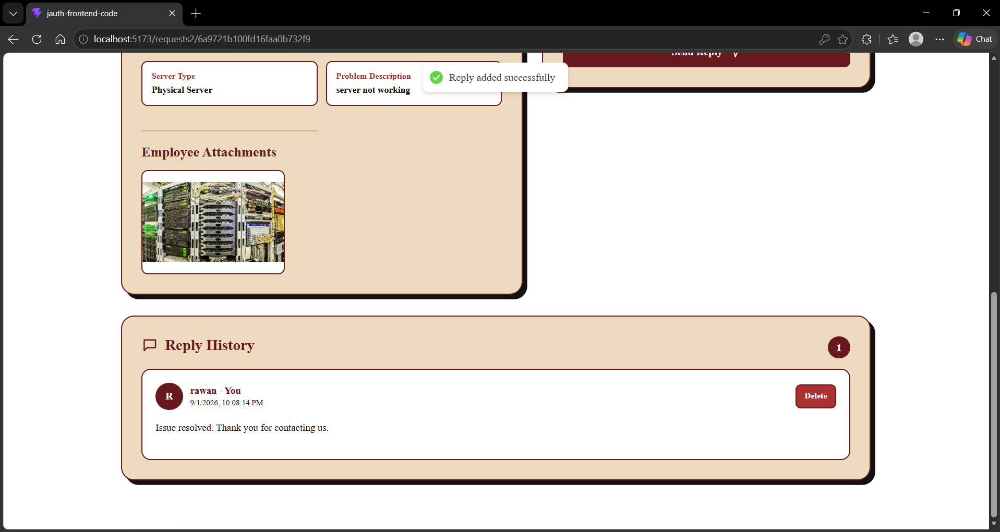
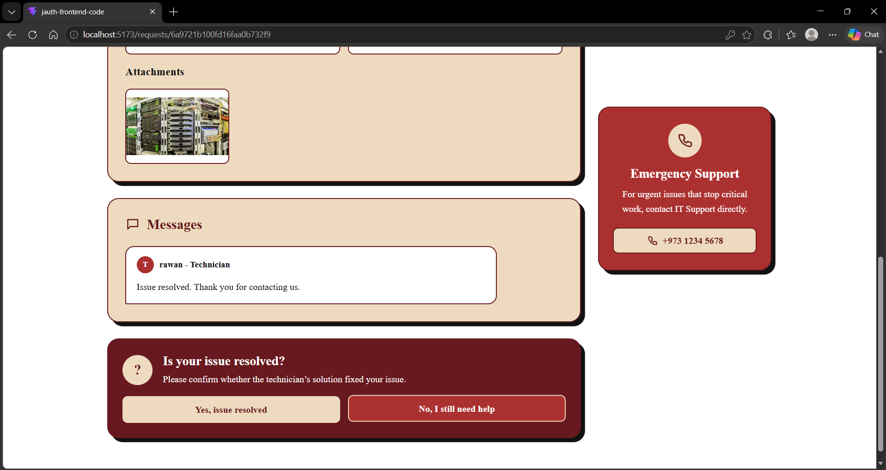
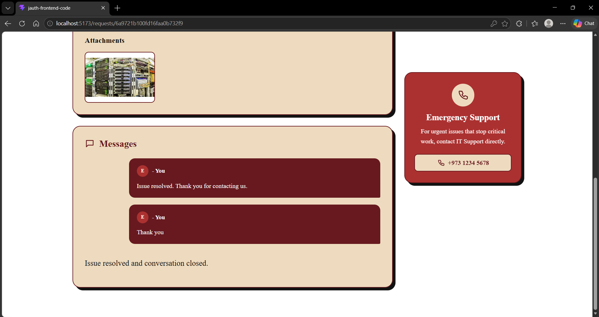

# Project Name 
IT Support Center — Frontend

## Overview

This is the frontend of a centralized IT support system designed for government organizations to reduce the high volume of technical support phone calls.

Employees can create and track support requests, select the relevant category and subcategory, provide issue details by filling out dynamic form, and communicate with technicians. Technicians can view incoming requests, send replies, update their progress, and wait for employees to confirm that the issue has been resolved.

## Live Application

- **Backend Repository:** [Deployed Frontend URL](https://github.com/FatimaS508/project4-backend)
- **Frontend Repository:** [Frontend Github Repository URL](https://github.com/FatimaS508/project4-frontend)

## Screenshots
### Home Page


### Employee Dashboard



### Create Support Request



### Employee Request History



### Technician Dashboard



### Active Requests



### Request Details and Replies




### Resolved Requests



## Technologies Used

- React
- Vite
- React Router
- Axios
- CSS
- Lucide React
- React Hot Toast

## Features

### Authentication and Users

- Employee and technician registration
- Role-based login and interfaces
- Protected routes
- Employee ID and department information
- Authentication using JSON Web Tokens

### Employee Features

- Browse IT support categories and subcategories
- Submit dynamic support request forms
- Select request priority
- Upload image attachments
- Receive an automatically generated request number
- View only requests created by the logged-in employee
- Search requests by title or request number
- Filter requests by status
- Sort requests by newest or oldest
- Edit requests while their status is New
- View technician replies
- Reply when an issue is not resolved
- Confirm that an issue has been resolved
- Preview request attachments

### Technician Features

- View new, active, and resolved request totals
- View new requests organized by category and subcategory
- Search requests by request number
- Sort requests by newest or oldest
- View employee ID and department
- View and preview employee attachments
- Reply to employee requests
- Delete replies
- View active requests
- View completed requests and final messages


## Project Structure

If you have different structure than this then add or remove from it

```text
src/
├── assets/
├── components/
├── context/
├── pages/
├── services/
├── styles/
├── App.jsx
└── main.jsx
```

## Getting Started

### Prerequisites

Install the following before running the project:

- node.js

The backend API has to be working. LINK TO THE BACKEND API

## Installation

### 1. Clone the repository

```bash
git clone FRONTEND_REPOSITORY_URL
cd FRONTEND_REPOSITORY_NAME
```

### 2. Install dependencies

```bash
npm install
```

### 3. Create the environment file

Create a `.env` file in the root directory:

```env
VITE_BACK_END_SERVER_URL=http://localhost:3000
```

### 4. Start the development server

```bash
npm run dev
```

Go to:

```text
http://localhost:5173
```


## Application Routes

## Application Routes

| Route | Page | Access |
|---|---|---|
| `/` | Home page | Public |
| `/sign-up` | Registration page | Public |
| `/sign-in` | Login page | Public |
| `/dashboard` | Employee dashboard | Employee |
| `/category/:categoryId` | Category details | Employee |
| `/request/:subcategoryId` | Create support request | Employee |
| `/requests` | Employee request history | Employee |
| `/requests/:requestId` | Employee request details and replies | Employee |
| `/requests/:requestId/edit` | Edit support request | Employee |
| `/dashboard2` | Technician dashboard | Technician |
| `/requests2/subcategory/:subcategoryId` | New requests by subcategory | Technician |
| `/requests2/:requestId` | Request details and technician reply | Technician |
| `/requests2/active` | Active request list | Technician |
| `/requests2/resolved` | Resolved request archive | Technician |


## User Stories

### Employee

* As an employee, I can create an account and sign in.
* As an employee, I can view available IT support categories and subcategories.
* As an employee, I can submit a support request with its priority and required details.
* As an employee, I can view and search my support requests.
* As an employee, I can filter my requests by status.
* As an employee, I can track the status of each request.
* As an employee, I can view and reply to the technician’s messages.
* As an employee, I can confirm when my issue has been resolved.
- As an employee, I can view only the support requests that I created.
- As an employee, I can search by request title or request number.
- As an employee, I can sort my requests by newest or oldest.
- As an employee, I can upload an image with my support request.
- As an employee, I can preview an uploaded attachment.
- As an employee, I can edit my request while its status is New.
- As an employee, I receive a unique request number for each request.

### Technician

* As a technician, I can create an account and sign in.
* As a technician, I can view support requests organized by category.
* As a technician, I can open a request and review its details.
* As a technician, I can reply to an employee’s request.
* As a technician, I can delete a reply.
* As a technician, I can update the progress of a request.
* As a technician, I can view resolved requests.
- As a technician, I can view new, active, and resolved requests separately.
- As a technician, I can search for a request using its request number.
- As a technician, I can sort requests by newest or oldest.
- As a technician, I can view the employee ID and department.
- As a technician, I can view and preview employee attachments.
- As a technician, I can view requests grouped by category and subcategory.
- As a technician, I can reject the requested issue and write the reason of rejection


## Future Enhancements

* Upload documents, and voice messages
* Send real-time notifications for request updates
* Add an administrator role to manage and verify users
* Support Arabic language
* let the technician reject the request
* Verify employee IDs against an organization database


## Team Members

| Name         | GitHub           |
| ------------ | ---------------- |
| Fatema Sami | https://github.com/FatimaS508 |


## Credits
- Some UI elements were inspired by or adapted from [Uiverse](https://uiverse.io/).
- Icons were provided by [Lucide](https://lucide.dev/).